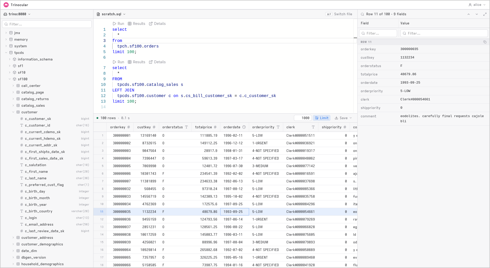

# Trinocular

A web-based SQL query IDE for the [Trino](https://trino.io) distributed query engine.



## Features

- Web application for querying and interacting with Trino clusters
  - Write and execute SQL statements; `USE`, `SET SESSION` and `PREPARE` carry over to the
    statements you run after them
  - Browse and inspect results
  - Explore catalogs, schemas and tables
  - Multi-cluster support
- Strong multi-user support
  - Authenticate using OIDC, or a list of users and passwords in the config
  - Authorize access to both the app and individual connections with rules over user claims
- Persistent storage of SQL files per user, in the browser or on the server
- Multiple options for persisting sessions and state (memory, SQLite, Valkey/Redis, PostgreSQL)

## Trying it

Nothing to clone: [`demo/compose.yaml`](demo/compose.yaml) runs Trinocular with nothing to
configure, and a recent Docker Compose can read it straight out of this repository. If you
have no Trino, it starts one:

```bash
docker compose -f "https://github.com/ragnard/trinocular.git#main:demo/compose.yaml" up
```

If you have one, name it and no second Trino is started:

```bash
TRINO_URL=http://host.docker.internal:8080 \
  docker compose -f "https://github.com/ragnard/trinocular.git#main:demo/compose.yaml" up
```

A Compose too old for the `.git#ref:path` form can be handed the file instead —
`curl -fsSL https://raw.githubusercontent.com/ragnard/trinocular/main/demo/compose.yaml | docker compose -f - up`
— and from a clone, `docker compose up` in `demo/` is the same thing.

Either way, Trinocular is on [http://localhost:3000](http://localhost:3000). There is no
login — everyone is `alice` — and nothing survives the containers. The bundled Trino is a
large image that wants a couple of gigabytes of memory, and it comes with the `tpch`,
`tpcds`, `memory` and `jmx` catalogs, so there is something to run straight away:

```sql
SELECT * FROM tpch.tiny.nation
```

Without compose, the same thing is one `docker run`:

```bash
docker run --rm -p 3000:3000 \
  --add-host host.docker.internal:host-gateway \
  -e TRINO_URL=http://host.docker.internal:8080 \
  -e ORIGIN=http://localhost:3000 \
  ghcr.io/ragnard/trinocular:latest
```

`ORIGIN` is not optional here even though there is no login: without it the server assumes
https and hands the browser follow-up URLs on a scheme nothing is listening on. Otherwise
`TRINO_URL` is the whole configuration. For anything more than a look —
a login, more than one cluster, sessions that outlive a restart — write a config file
instead; see [Configuration](#configuration).

## Running locally

Requires [bun](https://bun.sh) — as the runtime, not only the package manager: the server
reads YAML config and opens SQLite through bun's own APIs. `bunfig.toml` makes every
`bun run` script run under bun rather than node, so no `--bun` flag is needed.

```bash
bun install
bun run dev      # http://localhost:5173
```

For a look around, one variable is enough and there is no file to write:

```bash
TRINO_URL=http://localhost:8080 bun run dev
```

Otherwise Trinocular needs a config file and its own address. Point `TRINOCULAR_CONFIG` at the
file and set `ORIGIN` to the URL the app is served from — both can go in `.env`:

```
ORIGIN=http://localhost:5173
TRINOCULAR_CONFIG=config.dev.yaml
```

A minimal `config.dev.yaml` — no login, one cluster:

```yaml
session:
  cookie:
    secret: <at least 32 characters>

authn:
  kind: none
  user: alice

connections:
  local:
    name: Local Trino
    uri: http://localhost:8080
```

See [Configuration](#configuration) for everything else.

Other commands: `bun run build` (production build), `bun run preview`, `bun run check`
(type-check), `bun run format` (prettier).

## Configuration

The config file is JSON or YAML, named by the `TRINOCULAR_CONFIG` environment variable. It
is validated at startup; anything invalid stops the server rather than letting it come up
with half a policy. `${NAME}` in any string value is replaced with the environment
variable of that name — which is how the secrets stay out of the file, so that it can be
a ConfigMap with one Secret behind it; a variable that is not set stops the server, and
`$${` writes a literal `${`.

**[`config.example.yaml`](config.example.yaml) is the reference**: every option, with a
note saying what it does and what it defaults to, and at the top the environment variables
the server reads (`ORIGIN`, `TRINO_URL`, `LOG_LEVEL`, `PORT`/`HOST`, `BODY_SIZE_LIMIT`). As
written it is the simplest complete configuration — no login, everyone allowed, sessions in
memory, files in the browser, two clusters — and each section ends with what a deployment
swaps in, with its trade-offs, commented out and ready. In outline:

| Section | Decides |
| --- | --- |
| `branding` | The name, logo and a message in the top bar. |
| `session` | The cookie, and where sessions live: `memory`, `sqlite`, `valkey` or `postgres`. |
| `files` | Where users' query files live: the `browser` (localStorage, the default), `memory`, `sqlite`, `valkey` or `postgres`. |
| `authn` | Who the user is: `none` (everybody is one named user), `password` (users and passwords in the config) or `oidc`. |
| `authz` | Who is allowed in: `allow` (the default), a `cel` expression over the user's claims, or `require-keycloak-client-role`. |
| `connections` | The Trino clusters, each with an optional `authz` rule of its own that can only narrow the one above. |

The SQLite stores are for a single copy of Trinocular — the file is opened for this process
alone, and a second copy pointed at it refuses to start — which on Kubernetes is one
replica, a `ReadWriteOnce` volume mounted at `/data`, and a Deployment with
`strategy: Recreate` so an update stops the old pod before starting the new one. The Valkey
and Postgres stores are for any number of copies, and with sessions and files both in
Postgres one database is all a deployment needs. Sessions are encrypted in every store but
memory, with a secret of the store's own; files are not, in any store, since the SQL text is
what a copy of the store is for.

## Running the container

Images are published to GitHub Packages, as Debian slim (default) and distroless:

```bash
docker run --rm -p 3000:3000 \
  -e ORIGIN=http://localhost:3000 \
  -e TRINOCULAR_CONFIG=/etc/trinocular/config.yaml \
  -v "$PWD/config.yaml:/etc/trinocular/config.yaml:ro" \
  ghcr.io/ragnard/trinocular:latest
```

`ORIGIN` must be set: the session cookie's `Secure` flag is derived from it, and it is
where the OIDC provider redirects back to.

Every build of `main` is published under a version and under its commit, and the
distroless image under the same tags with `-distroless` on the end:

| Tag | Is |
| --- | --- |
| `0.1.212` | one build: `MAJOR.MINOR` from `package.json` and the number of the CI run that built it, so the number only ever goes up |
| `0.1` | the latest build of that series |
| `871beae…` | the same build, by the full commit hash |
| `latest` | the latest build |

The image is labelled and annotated with `org.opencontainers.image.version` and
`.revision`. A running instance says what it is on its first log line, on hover over the
name at the top left, and at the foot of the account menu, where the commit is a link.

To build it yourself:

```bash
docker build -t trinocular .                          # debian slim
docker build -t trinocular --target distroless .      # distroless
```

A build is told its version rather than working one out — the image's build context has no
git history in it — so one built by hand is `0.0.0` from an unknown commit unless you say
otherwise:

```bash
docker build -t trinocular \
  --build-arg TRINOCULAR_VERSION=0.1.42 \
  --build-arg TRINOCULAR_COMMIT=$(git rev-parse HEAD) .
```

The same two variables name a `bun run build` outside Docker, where the commit is read from
git when `TRINOCULAR_COMMIT` is not set.

### Health probes

Two endpoints answer without a session or a login, on the same port as everything else:

| Path | Says | Checks |
| --- | --- | --- |
| `/livez` | the process is answering HTTP | nothing else — a store outage never fails it, since a restart would not fix one |
| `/readyz` | this replica can serve requests | the session store and the file store each answer a ping (a `memory` or `browser` store always does) |

Both return `200` with a small JSON body, or `503` from `/readyz` with `{"status":"unavailable",
"checks":{"sessionStore":"failed","fileStore":"ok"}}` — the reason is in the log, not the
body. `GET` and `HEAD` are accepted. They are not written to the request log.

Readiness deliberately does **not** check the Trino clusters or the OIDC provider: those are
shared by every replica, so an outage there would pull every replica out of rotation at once
and turn "cannot run a query" into "cannot reach the site", for everyone already signed in.

```yaml
livenessProbe:
  httpGet: { path: /livez, port: 3000 }
  periodSeconds: 10
readinessProbe:
  httpGet: { path: /readyz, port: 3000 }
  periodSeconds: 10
```

## License

Apache License 2.0; see [LICENSE](LICENSE). Third-party material and its licenses are listed in
[NOTICE](NOTICE): the Trino SQL grammar and the Trino JavaScript client it builds on are Apache
2.0, and the Iosevka Aile font is under the SIL Open Font License 1.1.
